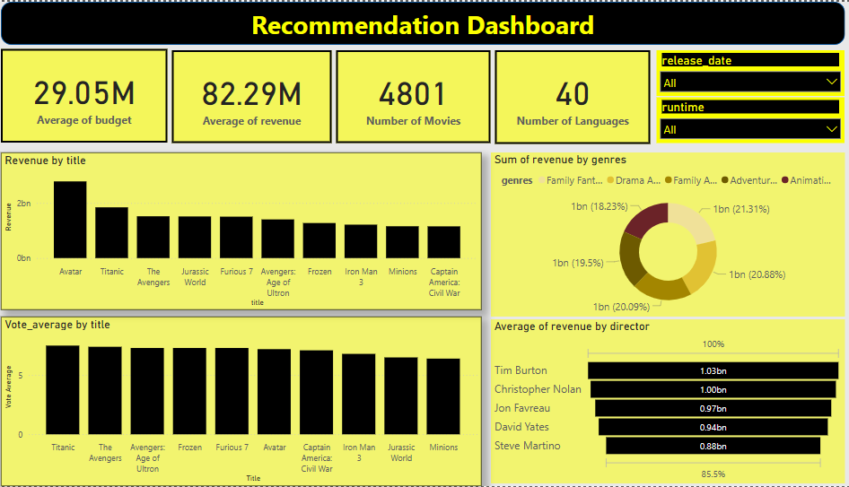

# Movie Recommendation System



## Overview
This project implements a **Content-Based Movie Recommendation System** using **TF-IDF Vectorization** and **Cosine Similarity** to find similar movies based on features like title, keywords, cast, and genres. The system suggests movies that are most similar to a given movie by analyzing textual data and computing similarity scores.


[Link to PowerBI Visualization](https://github.com/user/repo/blob/branch/other_file.md)

## How It Works

### 1. Feature Engineering: Combining Key Attributes
A new column, `combined_features`, is created by concatenating the **title, keywords, cast, and genres** of each movie. This ensures the recommendation system has enough context to compare movies effectively.

### 2. TF-IDF Vectorization: Converting Text into Numeric Data
To process textual data efficiently, **TF-IDF (Term Frequency-Inverse Document Frequency)** is used to transform text into numerical vectors. This helps measure how important a word is relative to all movies in the dataset. Additionally, stopword removal is applied to eliminate common words like "the," "is," and "and" to improve relevance.

### 3. Cosine Similarity: Measuring Similarity Between Movies
Once the data is vectorized, **cosine similarity** is computed between movies. Cosine similarity calculates the angle between two vectors, allowing the model to identify how closely related two movies are in terms of their textual content.

### 4. Generating Movie Recommendations
A function, `recommend_movies(movie_title, top_n=10)`, is implemented to:
- Find the index of the given movie title in the dataset.
- Compute similarity scores with all other movies.
- Sort the movies by similarity in descending order.
- Return the **top N most similar movies** based on content.

Additionally, a **popularity-based recommendation method** is included that suggests the highest-rated movies in the same genre.

## Installation
To use this project, ensure you have the required dependencies installed. You can install them using:
```bash
pip install -r requirements.txt
```

## How to Use
1. Ensure all files were gotten properly
2. Run the notebook to clean the movies data 
3. Run the recommendation.ipynb notebook and run the `recommend_movies` function with a movie title to get recommendations.
4. (Optional) Use the popularity-based recommendation method to suggest trending movies in the same genre.

### Example Usage
```python
recommend_movies("Avatar", top_n=5)
```
#### Output:
```
Recommended Movies:
1. Avengers: Endgame  
2. Interstellar  
3. Guardians of the Galaxy  
4. Star Wars: The Force Awakens  
5. The Martian  
```
For popularity-based recommendations:
```python
recommend_movies_by_popularity("Avatar", top_n=5)
```

