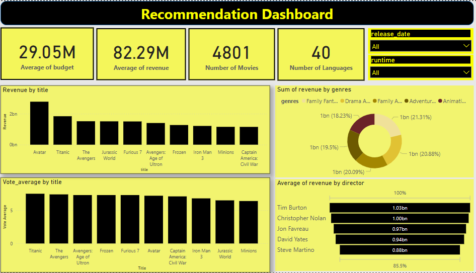

Movie Recommendation System

This project implements a Content-Based Movie Recommendation System using TF-IDF Vectorization and Cosine Similarity to find similar movies based on features like title, keywords, cast and genres. The system suggests movies that are most similar to a given movie by analyzing textual data and computing similarity scores.

How It Works
1. Feature Engineering: Combining Key Attributes
I created a new column called combined_features by concatenating the title, keywords, cast, and genres of each movie. This ensures the recommendation system has enough context to compare movies effectively.

2. TF-IDF Vectorization: Converting Text into Numeric Data
To process the textual data efficiently, I used TF-IDF (Term Frequency-Inverse Document Frequency), which transforms text into numerical vectors. This helps measure how important a word is relative to all movies in the dataset. Additionally, I applied stopword removal to eliminate common words like "the," "is," and "and" to improve relevance.

3. Cosine Similarity: Measuring Similarity Between Movies
Once the data was vectorized, I computed the cosine similarity between movies. Cosine similarity calculates the angle between two vectors, allowing the model to identify how closely related two movies are in terms of their textual content.

4. Generating Movie Recommendations
I implemented a function, recommend_movies(movie_title, top_n=10), which:

Finds the index of the given movie title in the dataset.
Computes similarity scores with all other movies.
Sorts the movies by similarity in descending order.
Returns the top N most similar movies based on content.
For an alternative approach, I also included a popularity-based recommendation method that suggests the highest-rated movies in the same genre.

How to Use
Load the dataset (movies.csv).
Run the script to process the movie features and compute the similarity matrix.
Call the recommend_movies function with a movie title to get recommendations.
(Optional) Use the popularity-based recommendation method to suggest trending movies in the same genre.
Example Usage
python
Copy
Edit
recommend_movies("Avatar", top_n=5)
Output:

markdown
Copy
Edit
Recommended Movies:
1. Avengers: Endgame  
2. Interstellar  
3. Guardians of the Galaxy  
4. Star Wars: The Force Awakens  
5. The Martian  
For popularity-based recommendations:

python
Copy
Edit
recommend_movies_by_popularity("Avatar", top_n=5)
Future Improvements
Enhance the recommendation system with hybrid filtering (Content-Based + Popularity).
Include cast & director weightage for better recommendations.
Improve performance using dimensionality reduction techniques.
Deploy as a web application with interactive UI.
Key Takeaways

Text-based features (title, genres, keywords, cast) are crucial for content-based recommendations.
TF-IDF and Cosine Similarity effectively measure movie similarity.
Filtering by genre and popularity improves recommendations.
The system is lightweight, interpretable, and easy to extend.
This project demonstrates how to build a simple yet powerful movie recommendation system using machine learning techniques without relying on user ratings.